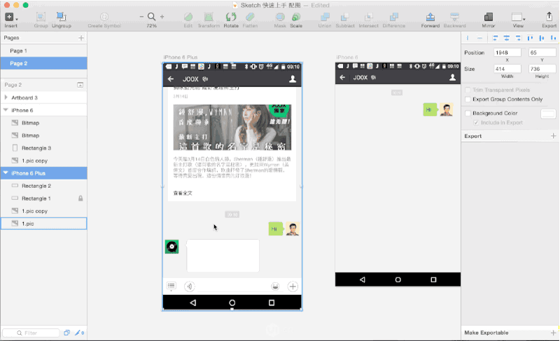
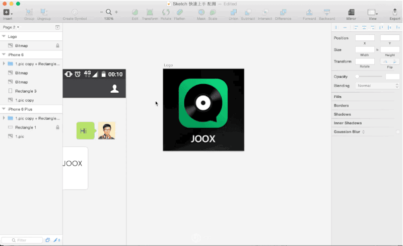
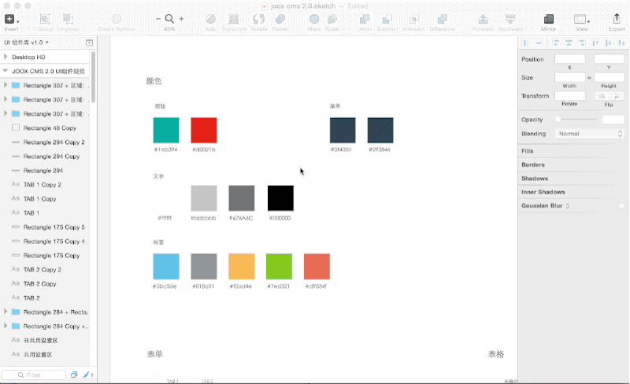
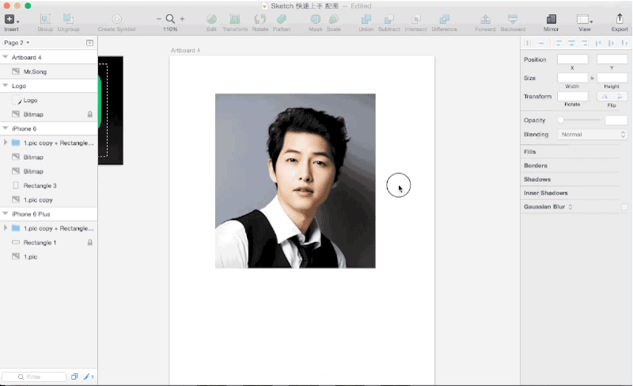
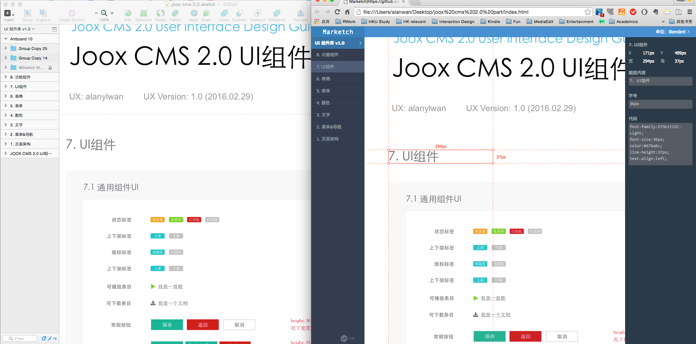
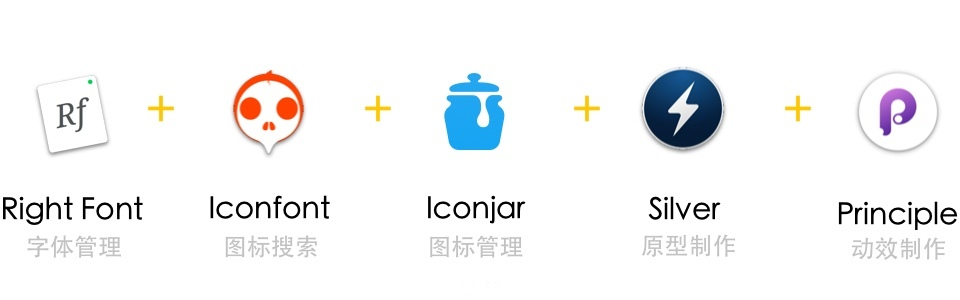
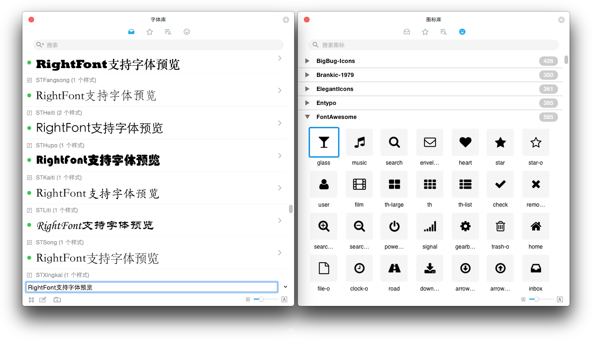
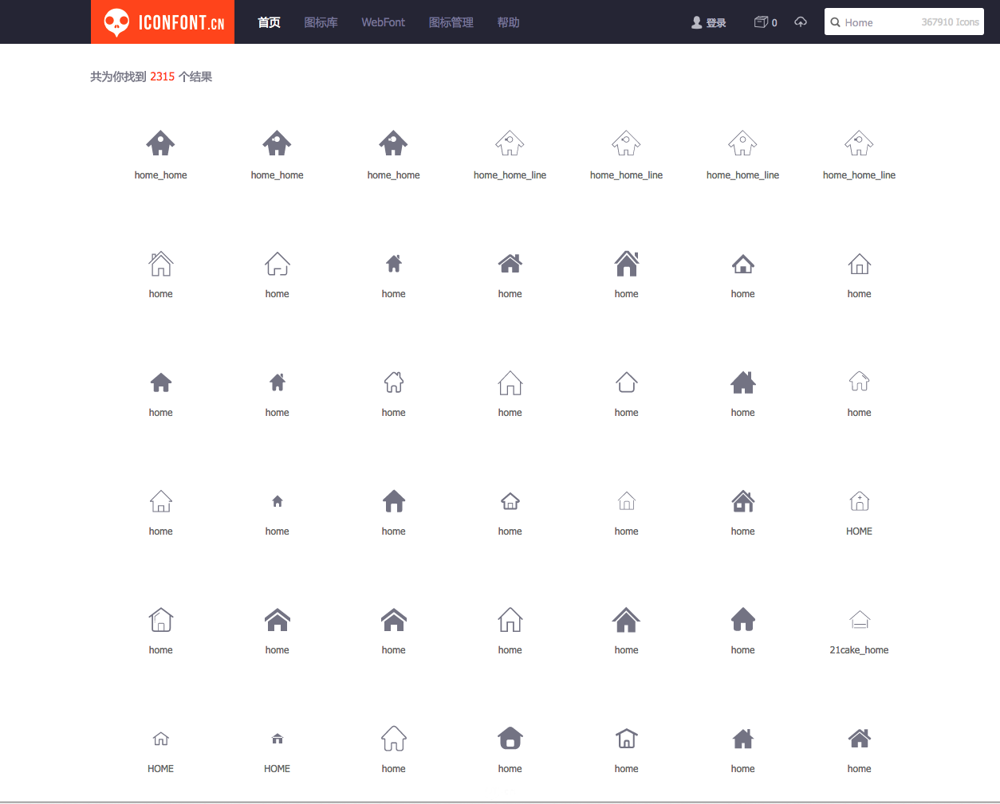
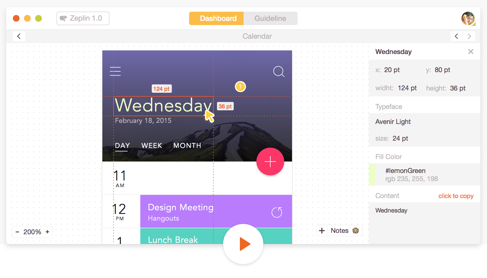
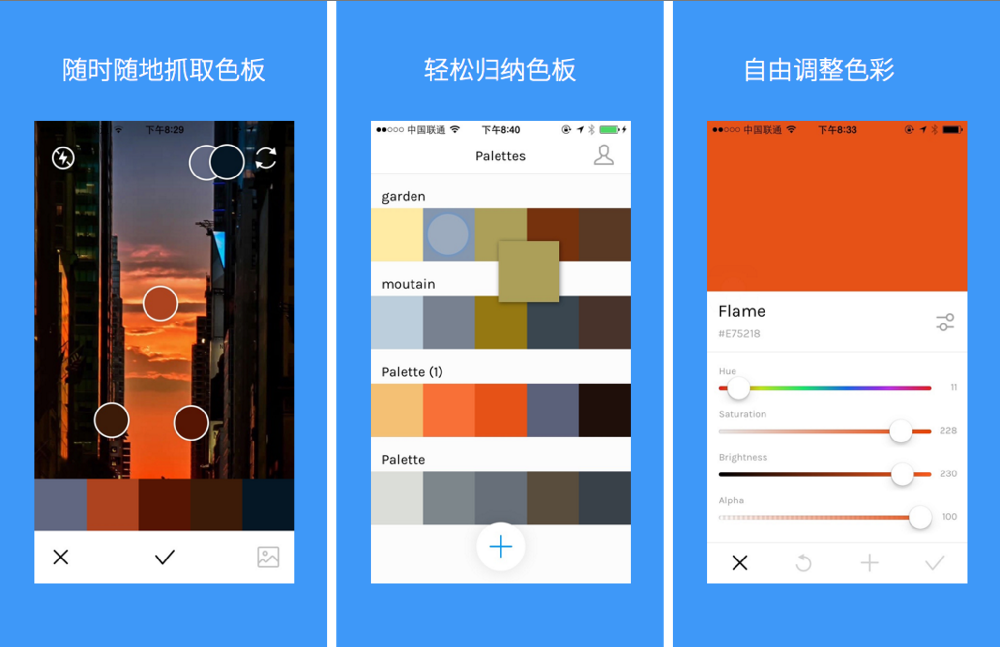

# sketch-practice

西乔：“sketch无学习门槛，能用keynote的人就自然会用，但sketch是非常有效的能解决问题的原型工具。对设计复杂度要求不高的，直接可以当设计工具用“

## 键盘key说明

大部分人都记不住这些按键，下面给出说明

| Symbol    | Key         | 
|:---------:|:-----------:|
|  &#8984;  | Command Key |
|  &#8963;  | Control Key |
|  &#8997;  | Option Key  |
|  &#8679;  | Shift Key   |

# 4步上手

http://www.ui.cn/detail/110445.html

本文系sketch快速上手指南，适用于没时间细细研究工具的同学。据内部线报，某宝UED全线交互&视觉，部分产品&开发已重度使用Sketch，甚至有小组专门开发相关插件。为了让更多人体验到Sketch的高效，以及回答『能不能一下就教会我怎么用Sketch？』等老大难问题，我总结了使用Sketch的核心步骤，精简为A.R.T.S四步。

实在想不出比这更快的上手方式了 ＝)

这图说的挺好的

## 准备工具

- 一台Mac：希望PC同学看到这里不要默默按下关闭… 话说Apple新一季正好到了，考虑一下？
- Sketch软体：虽说有试用版也有破解版，但699RMB的价格其实并不高。一个包包换一个设计师饭碗呢。 而且软件体积不到39M，跑起来飞快，启动和等待时间几乎忽略不计。实在不想花钱想先试试的话…天朝百度你懂的
- Magic Mouse鼠标（可选）：刚开始会觉得难用，但习惯后全方向移动画布的感觉确实很赞。没有触控板的iMac强烈推荐。

##  ARTS 教程，只要四步

ARTS四个字母其实是Sketch的四个快捷键，也是使用流程中的四个重要步骤，分别对应 Artboard “创建画板”, Rectangle “创建矩形”，Text “创建文字” 和 Slice “创建切片”。这四个操作都可以在左上方的 Insert 新建菜单中找到，但记下这四个常用快捷键会极大地加快设计流程。

“画板”的概念，是Sketch有别与其他工具的最重要元素之一，也是我作为交互最喜爱的功能。简单来说，你设计的应用里的多个界面可以各自放在单独的画板里，然后所有的这些画板同时放在一个界面中，让你更有效地在设计时审视界面间的逻辑关系。多画板设计是设计软件的大势所向，新版的Adobe Photoshop CC 2015 和 Adobe Experience Design都能见到它的影子。

所以首次进入界面，不要被洁白的底色所困惑，请先按下A键，新建一个画板。Sketch预设了很多尺寸的画板，比如想设计 Iphone6 界面，按下A后直接选用右侧的Iphone6即可。不要为画板中默认被除以2的尺寸担心，这是矢量作图，后续切图中你可以输出任意你想要的尺寸。

如果预设中没有想要的尺寸，你也可以在按下A后直接在界面中拖动鼠标，建立任何尺寸的画板，然后随意地挪动它。所有画板的尺寸，位置，和背景颜色，都可以在选中画板后右侧【属性栏】中精确调整。你可以单击画板的名称来选中画板，或者在左侧【图层栏】中单击它。

在完成多个画板后，想把他们合到一张大的流程图里，并做好相应的标注和说明的话，你可以在所有画板下新建一个大的画板，把所有小画板都装起来，并在上面绘制相应的流程箭头和说明。所有画板都可以单独输出为一张图，方法是选中画板，在右侧属性栏中，点击Export右侧的加号，选择想要的尺寸倍率和图片格式，点击右下角Export Artboard即可。

所有复杂的界面都由简单的基本元素构成，作为交互来说，最常用的初始元素是矩形无疑。

单击R并拖动鼠标后，你会得到一个矩形为基本元素。单击选中这个矩形后，即可在右侧的属性栏中任意改变它的位置尺寸，圆角半径，透明度，颜色等。从一个简单的矩形开始，他既可能成为一个重要元素的一部分（比如涉及千亿流水的“购买”按钮），也可以变成任意你能想象到的形状。

双击这个矩形，即进入设计师们熟悉的贝塞尔曲线编辑(Edit)模式。选中已有的点即可编辑点的各项属性，点击矩形边缘可以新增编辑点。按住shift或者直接拖动，即可选中并时移动多个编辑点。

如果想创建其他形状的基本元素（比如圆形来表示头像），也可以按下O并拖动来新建一个圆形（Oval），或者L来插入一条直线（Line）。多个图形可以通过布尔运算迅速组合成新的图形，方法包括“组合”，“相减”，“相交” 和 “相异”。这四个按钮在上方工具栏，视觉同学用到它的次数会多一些。

Tips：如果想看到某个元素和其他临近元素的距离，你可以选中它并按下alt。 这能帮助设计师精确地调整布局。

文字是设计稿中必不可少的元素，合适的字体，尺寸和对齐方式足以花费设计师成吨的时间。

点击T并拖动鼠标来创建一段文字，文字常见的属性都可以在右侧调整。比较特殊的是宽度(Width)属性，你可以选择自动(Auto)来通过调节宽度以自适应高度，或者固定(Fixed)来固定文字宽高。注意在Fixed下，可能出现文字被裁剪的情况（特别是在增加字体大小之后）。

注意：Sketch对中文字体的显示偶尔会出现小Bug，编辑时文字消失。大多数情况下切换宽度的两个状态就能刷新并解决这个问题。后续新版本有望解决。

当你已经建立了一个矩形并写了一段文字后，你可能想把他们编辑到一个组（比方说设计一个按钮），你可以按住 shift 同时选中要成组的元素，随后按下Command + G 来让他们成组（或者右键选择Group Seletion）。之后再单击他们时，默认会选中这个组。双击这个组可以在组内选中内部元素。同时你也能看到左侧的图层栏中，它们被放到了一个文件夹中，并可以被拖动来改变显示的前后顺序。

- Tips：你可以按住Command 并单击鼠标左键来快速选中组里最深层的内容。这在跨组复选元素时非常有用。
- Tips2：按住alt并拖动元素，可以复制这个内容到指定的位置。这对单个元素，成组元素，乃至画板都有效。这也是ps和ai里通用的复制方式。

当你想切出画板内的一个部分而非整个画板的时候，切片工具便派上了用场。与PS繁琐的切图工具不同，Sketch的切图工具非常简单直观，按下S并拖出一个矩形即可 - 这个简单的虚线矩形即是一个导出切片。

和所有其他元素一样，切片有自己的图层，也可以在右侧改变它的各种属性，唯一不同的是可以在右下导出这个切片里的内容，导出图默认会以切面的图层名称命名。

如果已经做好了一堆切片，可又想改动切片底下的内容怎么办？只需点击左下角选择切片图层或普通图层的互动开关（默认都可互动）。关闭了切片的互动开关后，即可在不影响切片的情况下改变普通图层，需要切图时再点亮开关即可。

切片的另外一个被许多人称道的功能，便是它自由的输出尺寸。点击切片并在右侧属性栏内改变Size内x乘的数值，便可以输出任意倍率的图片。你甚至可以添加多个尺寸，一次性输出1x, 2x, 3x, 0.9x 甚至是10x图到一个文件夹。你还可以直接通过修改Suffix（后缀）来提前命名导出图，比如导出button_@2x.png,  拖进xcode便可自动识别图片，省去了ios开发的繁琐命名工作。

另外，sketch也是难得的可以轻松导出svg格式的轻量制图软件。这些细微的细节整合起来，组成了方便快捷的Sketch输出方式。

- Tips: 切片和画板的导出预览图，可以直接拖拽出来添加到文档里，连导出的步骤都省了。

## 进阶功能册

以下是一些让工作更愉快的进阶小技巧，有兴趣可以看一下 ＝）

###  版本管理

版本管理是有条理归档交互稿的重要方法。可以通过Pages(页面)的方式实现。点击左上角当前页面右侧的方形小icon，即可展开Pages管理面板。一个Page页面可以理解为存放Artboard画板的空间，每次小版本的迭代，可以在这里直接复制一个Page以版本号命名重命名，内部的画板都会被复制。交互同学应该会觉得很熟悉 - 这样的版本管理方式与Axure相近；而视觉同学也可以避免建立多个文件来管理版本的方式

###  标尺，格子和参考线

标尺是精细化设计的必备工具。 按下ctrl + R 快速显示标尺（Ruler），或者单击右上角View也可以直接设置显示/隐藏标尺，或者格子(Grid)。在菜单内settings里面进行更详细的设置。拉参考线的方式是在标尺上单击，且参考线只能在标尺上被移动。如果把参考线拉出视窗外，参考线即被删除，这点与Axure不同需要留意。

### 蒙板

蒙板可以做出很多有趣的设计。希望用上层作为遮罩显示出下层的内容，只需要选中两个重叠的元素并点击顶部的Mask（蒙板）即可，他们会被合并在一个文件夹内，且上方的元素会成为蒙板，有显著的小圆点标志。你可以随时拖动新的元素进入文件夹底部来作为隐藏内容，或者右键图层并选中“Use as mask” ，来让新的图层作为蒙板。

### 符号

许多共用元素可以通过“符号”来进行批量调整。选中一个可以复用的组元素（如按钮，输入框，菜单栏等），点击左上方创建符号（create symbol），即创建了一个通用样式的组元素，且左侧图层栏中文件夹的颜色变为了紫色。之后的设计中，你随时可以通过左上角 “插入”->“插入符号” insert symbol 插入已经做好的这个组元素。任何对这个组元素的调整都会立即同步到所有符号中。

### 同步到手机

设计师经常会将设计稿导入手机以查看真机效果。你可以花点小钱另外购置Sketch Mirror的手机应用，然后通过点击右上角的Mirror按钮来无缝把设计稿同步到手机中。也可以像我一样使用Principle等应用，直接设计原型或动效来传输到手机里。当然，鉴于Sketch轻松愉快的切图，把图片导出并通过微信或者RTX发到手机，也并不是什么太麻烦的事情。

### 插件

Sketch一向以简洁和高效著称，只列出设计师最需要，最常用的功能。然而如果有更进阶的需求，设计师可以选用各式各样的Sketch插件来满足定制化的要求，如自动安卓切图，自动生成.9图，自动填充等。知乎和优设上有各式各样的插件推荐，这里只重点推荐Craft 和 Marketch

#### Craft ，将时间省到极致

其实是四个小组件和合集，分别可以『行列复制组内容』，『一键填充本地或在线图片』，『规范生成和管理』以及『默认文字按类别』，连设计师从网上找示例图片和想默认文字的时间都省掉了。另外Craft收购了我一直心心念的 SilverFlow，于是Craft 2.0很快连可交互原型都能做了。具体请看视频（英文）

http://v.qq.com/boke/page/o/0/3/o01883vw283.html

Craft主页及下载地址：http://labs.invisionapp.com/craft

#### Marketch，设计和开发的终极分歧终端机

将设计稿一键转化成前端网站（可传送的本地文件），让前端同学直接参考。之前曾经使用过zeplin小飞艇, 可以在线做同样的事情。然而考虑到注册成本和云文件安全性，后来还是弃用了。Marketch则更好的解决了这个问题：不需要注册即可浏览，而且保存成本地文件（当然是以开发者不商业化为代价...God Bless Programmers）。

Demo地址（生成效果）: http://tudou527.github.io/marketch/

Github 下载地址：https://github.com/tudou527/marketch

##  配套软件集

再推荐几个让交互用 Sketch 更幸福的配套工具，其中有不少是对PS一样支持的。

### RightFont

- Mac上的字体管理专家（收费，有试用版）

        
Mac上的字体管理神器，可以筛选字体，预览字体效果，点击即应用字体到Sketch，或收藏常用的字体。我试过搜索同类软件的免费版，但最终还是没有一款能匹敌它。最新版本甚至内置了多个图标库，直接从里面就可以搜索svg格式的图标并拖拽到sketch里用，颜色任调，双击还可以编辑形状！用上这个功能后，我乖乖付费成为了人民币玩家。

图文介绍戳 http://www.uisdc.com/font-manage-tool-rightfont

国内合作方 http://zhuanlan.zhihu.com/pinapps/20435676

### IconFont

- 矢量图标搜索利器（免费）

svg 矢量图标在线合集。虽然很不想为某宝做广告，但是找扁平化图标用这个网站确实方便。对交互能节省很多找图标的时间，也能为轻量图标制作找灵感。

网址： www.iconfont.cn

### IconJar

- 专业图标管家（收费，有破解版）

如果你有收集并使用图标的习惯，那么它是我用过最适合在mac上管理图标素材的软件。图标可以轻松分组，并打包带走。

介绍链接 http://www.uisdc.com/icon-manage-tool-iconjar

### Principle

- 1分钟做动效（收费，有试用版）

高效制作页面动效的工具，学习曲线非常平滑。它的设计思路是，绘制好初始帧和结束帧，软件会自动计算并生成补间动画（两帧之间必须有相同元素）。产出可以同步到真机演示，也可导出成gif或者mov传播。相比其他工具，Principle支持直接通过拖动sketch内的图层或者文件夹到Principle中，连切图的工作都省了。后续计划再写一篇Principle的上手 （手动挖坑）

### Silverflow（即将推出）

- 设计稿变原型(已加入Craft豪华午餐包)

一个开发中的插件，可以支持设计师在Sketch里直接做可交互原型。如前文所说，目前它家已经被大名鼎鼎的Invision团队收购，加入了invision旗下的craft插件合集。以后做好的设计稿，可以直接在输出成可交互Demo并导入到手机给其他人试用，不需要另外的原型工具…想想怎是一个赞字了得。

想了解更多，可以查看之前翻译的介绍Silverflow的文章 http://www.ui.cn/detail/81033.html

另外最近大热的Adobe 家新秀 Experience Design (简称XD，莫名喜感)，也支持了原型的制作和同步，不过目前切图，图层等细节功能尚未完善。期待在原型制作领域有更多的好功能出现！

## zeplin

https://www.zeplin.io/

西乔推荐，导出工具，确实很棒

## Sip for Mac and iPhone

Sip是一个非常出色的iOS app，它能帮助你从照片中创建色板。并且你可以在你的Mac或手机上随时随地使用它捕捉那些美丽的色彩。

## Affinity Designer
Affinity Designer是Mac上一个快速、流畅以及精确的矢量图形设计软件。你可以使用它来作广告、图标、UI或是创作概念艺术。在全世界超过 2500 个应用商店评级中获得平均 5 颗星—并且从一开始就成为了“编辑推荐选择”，被特别推荐为 2014 最佳新应用程序之一，并因其令人惊叹的性能和功能在 2015 年 6 月的苹果全球开发者大会上获得了令人垂涎的苹果设计奖。

## PaintCode
你可以使用PaintCode方便地进行图形设计，你也可以将SVG或PSD文件导入到PaintCode中，然后它就能帮助你将你的设计转换成Objective-C,Swift或C#代码。

## Pixave 2

设计师需要不断去收集优秀的设计作品，以此来提升自己的设计感觉。我之前一直在使用Ember,但它已经停产了，并且它并不能支持一些最新格式的设计文件，比如Sketch,Affinity Designer等。Pixave 2 是一个很好的替代者，它支持几乎所有与设计相关的文件格式。

## 最后的唠叨

作为一个绘图工具，Sketch实在太直观了，很多功能保证你一看就会用。真难想象我居然花了这么多字数来介绍他。其实，真正难的不是上手，而是用它开始画第一个界面。还是那句话：工具只是工具，更重要的是你的idea。说这么多，不如现在就开始，A一个画板，结合一个工作项目来试一试它吧 - 会比你想象中的容易多了。

至于是否要替代Axure或者Photoshop, 我想它们间并不冲突，你可以都试用之后，再选择 “最适合自己的” 作为生产工具。对我来说，Sketch兼顾了“快”和“精细”的要求。而 “天下武功，唯快不破”。

# 快捷键操作

## 用正确的方式缩放

- 缩放到100%：⌘+0；
- 查看你画布全部的设计：⌘+1;
- 缩放特定的对象：选择对象然后按下⌘+2。

## 隐藏/显示sidebars

如果你在一个小的屏幕上作业，你可能需要隐藏左右两边的图层面板（Layer-List-sidebar）和右侧的工具面板（Inspector Sidebar）

- 只隐藏左侧⌘+⌥+1
- 只隐藏右侧⌘+⌥+2
- 隐藏或显示全部使用⌘+⌥+3

## 全屏模式

进入”Presentation” mode(全屏模式)，将会让你的作品全屏展示

- 按下⌘+.

### 标尺

在标尺上双击可以添加参考线，将参考线拖到最左侧或者最右侧就会将其删除（直接delete也可以）

- 显示或者隐藏标尺：Ctrl+R

## 查看对象间的margin值（CSS属性）

按下⌥，选中对象即可

## 改变对象尺寸

按下⌘+方向键可以改变对象的尺寸，同样的按下⇧+⌘+方向键可以每次10px的改变对象的尺寸

## 为对象命名和建组

每次我创建新的对象的时候，为其名一个有意义的名字或分组

- 改名使用⌘+R
- 建组使用⌘+G

## 复制对象

- 复制使用⌘+C
- 粘贴使用⌘+V
- 复制后粘贴⌘+D

# 推荐

先聊聊它秒杀Photoshop的原因：

- [《UI设计师新宠！聊聊SKETCH那些方便好用的贴心功能》](http://www.uisdc.com/intimate-sketch-feature)

来两篇Sketch新鲜教程练手！

- [《设计师新宠！教你利用SKETCH创建彩色开关（上）》](http://www.uisdc.com/use-sketch-design-switch-1)
- [《设计师新宠！教你利用SKETCH创建彩色开关（下）》](http://www.uisdc.com/use-sketch-design-switch-2)

 